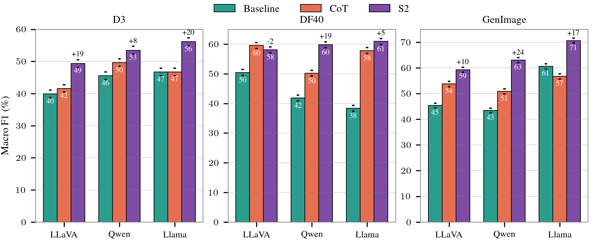

# Prefilled Responses Enhance Zero-Shot Detection of AI-Generated Images

[](https://www.python.org/downloads/release/python-3110/)
[](https://pytorch.org/)
[](https://github.com/vllm-project/vllm)
[](LICENSE)
[](https://arxiv.org/abs/2506.11031)

## 🤝 Citation

If you use this code in your research, please cite our paper:

```bibtex
@misc{kachwala2025prefilledresponsesenhancezeroshot,
      title={Prefilled responses enhance zero-shot detection of AI-generated images}, 
      author={Zoher Kachwala and Danishjeet Singh and Danielle Yang and Filippo Menczer},
      year={2025},
      eprint={2506.11031},
      archivePrefix={arXiv},
      primaryClass={cs.LG},
      url={https://arxiv.org/abs/2506.11031}, 
}
```

*Note: Paper submitted to ACL ARR.*

---

<p align="center">
  
</p>

> **Can you tell which images above are real vs AI-generated?** Answer in footnote¹

This repository contains the evaluation system for our paper on using **Prefill-Guided Thinking (PGT)** to detect AI-generated images with Vision-Language Models (VLMs).

> 💡 **For detailed technical documentation, particularly helpful for LLM code agents**: See [AGENTS.md](AGENTS.md) for complete architecture details, function signatures, and implementation specifics.

**Key Finding:** Simply prefilling a VLM's response with the phrase *"Let's examine the style and the synthesis artifacts"* improves detection by up to **24% in Macro F1** — without any training or fine-tuning.

## 🎯 What is Prefill-Guided Thinking?

<p align="center">
  
</p>

Instead of asking a VLM to detect fake images directly, we **prefill** its response to guide its reasoning:

- **(a) Baseline**: No guidance → incorrect classification
- **(b) Chain-of-Thought**: Generic reasoning phrase → still incorrect
- **(c) S2 (our method)**: Task-aligned phrase → correct classification ✓

**The magic phrase:** *"Let's examine the style and the synthesis artifacts"*

This simple technique works across **3 VLMs** and **16 different image generators** spanning faces, objects, and natural scenes.

---

## 🚀 Quick Start

### Installation

**See [SETUP.md](SETUP.md)** for complete environment setup instructions (conda, PyTorch, vLLM, Flash-Attention).

### Usage

**See [Usage Examples](AGENTS.md#-usage-examples)** for detailed command-line examples and all available options.

---

## 📊 Datasets

We evaluate on three diverse benchmarks:

| Dataset | Content | Images | Generators |
|---------|---------|--------|------------|
| **D3** | Diverse web images (objects, scenes, art) | 8.4k | 4 (Stable Diffusion variants, DeepFloyd) |
| **DF40** | Human faces (deepfakes) | 10k | 6 (Midjourney, StyleCLIP, StarGAN, etc.) |
| **GenImage** | ImageNet objects (animals, vehicles) | 10k | 8 (ADM, BigGAN, GLIDE, etc.) |

### Setup Data

**See [Data Collection & Setup](AGENTS.md#-data-collection--setup)** for complete instructions on downloading and organizing all three datasets.

---

## 🧪 Supported Models

- **Qwen2.5-VL-7B** - Native dynamic-resolution ViT
- **LLaVA-OneVision-7B** - GPT-trained multimodal model
- **Llama-3.2-Vision-11B** - Vision adapter + Llama 3.1 LM

All models use instruction-tuned variants via vLLM for efficient inference.

---

## 🎨 Three Evaluation Methods

| Method | Description |
|--------|-------------|
| **Baseline** | No prefill, just ask the question |
| **CoT** | Chain-of-thought reasoning |
| **S2** | Task-aligned (our method) |

**See [Usage Examples](AGENTS.md#-usage-examples)** for detailed command-line examples and all available options.

---

## 📈 Results

<p align="center">
  
</p>

**Detection performance (Macro F1) across models, datasets, and PGT variations.** Bars are annotated with relative improvements of S2 over the next best method and 95% confidence error bars from 10k bootstrap iterations.

<p align="center">
  
</p>

**Detection performance (Recall) for Llama across different datasets and their state-of-the-art synthetic image generators.** Similar figures for LLaVA and Qwen in the paper.

---

## 🔬 Advanced Usage

- **Multi-Response Generation (n>1)** - Generate multiple responses with majority voting → [Details](AGENTS.md#multi-response-evaluation-n1)
- **Phrase Modes** - Test prefill vs prompt vs system instruction → [Details](AGENTS.md#five-phrase-modes)
- **Debug Mode** - Quick validation with 5 examples → [Details](AGENTS.md#debug-mode-testing)

---

## 📂 Output Structure

Results are saved in hierarchical directories with timestamped JSON files containing metrics and full reasoning traces.

**See [Output Structure](AGENTS.md#-output-structure)** for detailed file organization and JSON schemas.

---

## 📊 Visualization & Analysis

Generate publication-ready plots (Macro F1 bars, radar plots, vocabulary analysis, etc.)

**See [Plotting & Visualization System](AGENTS.md#-plotting--visualization-system)** for available plots and usage instructions.

---

## 📚 Documentation

- **[SETUP.md](SETUP.md)** - Environment setup and installation instructions
- **[AGENTS.md](AGENTS.md)** - Complete technical reference (architecture, function signatures, all details)
- **Paper** - [arXiv:2506.11031](https://arxiv.org/abs/2506.11031)

---

## 👥 Authors

**Zoher Kachwala** · Danishjeet Singh · Danielle Yang · Filippo Menczer

Observatory on Social Media
Indiana University, Bloomington

---

<sub>¹ **Answer to image quiz:** Only images 3, 10, and 11 in the mosaic are real. All others are AI-generated.</sub>
