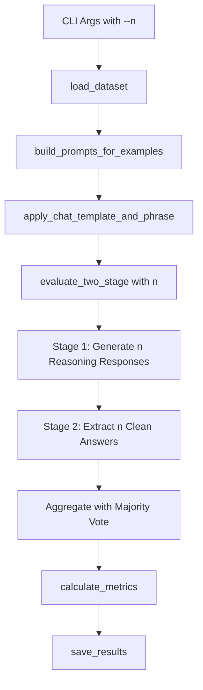

# Zero-shot PGT Evaluation System - Architecture Documentation

## 📚 **Codebase Overview**

This is a **clean, functional two-stage evaluation system** for testing Vision-Language Models (VLMs) on AI-generated image detection using different phrase prompting strategies with support for **multi-response generation (n>1)** and **majority voting aggregation**. The architecture follows DRY principles with **3 core scripts** and supports **five phrase modes**: prefill, prefill-pseudo-system, prefill-pseudo-user, prompt, and instruct.

### **Environment Prerequisites**
```python
# Essential environment variable for vLLM logging integration
os.environ['VLLM_CONFIGURE_LOGGING'] = '0'  # Set before any vLLM imports
```

### **Architecture Files**
```
config.py               # Configuration registries & constants (~315 lines)
helpers.py              # All utility functions (~750 lines, consolidated)
evaluate.py             # Main evaluation pipeline (~220 lines)
```

---

## 🎯 **Five Phrase Modes**

The system supports five different ways to inject a phrase (e.g., "Let's think step by step") into the prompt:

| Mode | Description | Example with phrase "Let's think step by step" |
|------|-------------|------------------------------------------------|
| **prefill** | Append phrase after chat template | `...assistant\nLet's think step by step` |
| **prefill-pseudo-system** | System instruction to start with phrase | System: `'Please start your response with "Let's think step by step"'` |
| **prefill-pseudo-user** | User instruction to start with phrase | User: `"Is this image real or AI-generated? Please start your response with 'Let's think step by step'"` |
| **prompt** | Append instruction to question | User: `"Is this image real or AI-generated? Please think step by step."` |
| **instruct** | Instruction in system message | System: `"Please think step by step."` |

**Special case:** The `baseline` phrase (empty string) ignores mode and outputs to `baseline/` directory.

---

## 🔢 **Multi-Response Generation (n>1)**

The system supports generating multiple responses per input with majority voting aggregation:

### **Temperature Control**
- **n=1**: `temperature=0.0` (deterministic, both stages)
- **n>1**: `temperature=1.0` (Stage 1 reasoning), `temperature=0.0` (Stage 2 answer extraction)

### **Two-Stage Process with n Responses**
```python
# For n=5:
# Stage 1: Generate 5 different reasoning responses (temperature=1.0)
Input: [Image + Question + Phrase]
Output: 5 × [Full reasoning response]

# Stage 2: Extract 5 clean answers (temperature=0.0 for each)
Input: 5 × [Image + Question + Phrase + Reasoning + "Final Answer:"]
Output: 5 × [Clean answer]

# Aggregation: Majority voting (tie-breaking prefers 'real')
Final Prediction: most_common(5 answers)
```

### **Nested JSON Structure**
```json
{
  "image": "/path/to/image.jpg",
  "question": "Is this image real or AI-generated?",
  "full_prompt": "Complete prompt...",
  "ground_truth": "ai-generated",
  "responses": [
    {
      "reasoning_response": "Let's examine... [response 1]",
      "clean_answer_response": "real",
      "extracted_prediction": "real",
      "score": 0
    },
    {
      "reasoning_response": "Let's examine... [response 2]",
      "clean_answer_response": "ai-generated",
      "extracted_prediction": "ai-generated",
      "score": 1
    }
    // ... 3 more responses (for n=5)
  ],
  "aggregated_prediction": "ai-generated",  // majority vote
  "aggregated_score": 1,
  "vote_distribution": {"real": 2, "ai-generated": 3}
}
```

---

## 📋 **Function Signatures Reference**

### **config.py** - Configuration Management

#### Configuration Getters
```python
def get_model_config(model_name: str) -> Dict[str, Any]
def get_dataset_config(dataset_name: str) -> Dict[str, Any]
def get_phrase_text(phrase_name: str) -> str
def get_phrase_instruction_version(phrase_text: str) -> str  # Converts "Let's X" → "Please X."
```

#### Validation & Support Lists
```python
def validate_config_combination(model_name: str, dataset_name: str, phrase_name: str) -> bool
def get_supported_models() -> list
def get_supported_datasets() -> list
def get_supported_phrases() -> list
```

#### Output Management (with n support)
```python
def get_output_dir(dataset_name: str, model_name: str, phrase_name: str, mode: str = 'prefill', n: int = 1) -> Path
def get_logs_dir(dataset_name: str, model_name: str, phrase_name: str, mode: str = 'prefill', n: int = 1) -> Path
```

---

### **helpers.py** - Core Utilities

#### Data Loading Functions
```python
def load_dataset(dataset_name: str, logger) -> List[Dict[str, Any]]
def _load_csv_dataset(dataset_config: Dict[str, Any]) -> List[Dict[str, Any]]
```

#### Prompt Building Functions
```python
def build_prompts_for_examples(examples: List[Dict[str, Any]], phrase_name: str, model_name: str, logger, mode: str = 'prefill') -> List[Dict[str, Any]]
def _build_single_prompt(example: Dict[str, Any], phrase_text: str, model_name: str, mode: str = 'prefill') -> Dict[str, Any]
def apply_chat_template_and_phrase(examples: List[Dict[str, Any]], model_name: str, logger) -> List[Dict[str, Any]]
```

#### Two-Stage Evaluation Functions (with n support)
```python
def evaluate_two_stage(examples: List[Dict[str, Any]], model_name: str, logger, n: int = 1) -> List[Dict[str, Any]]
def _generate_stage1_responses(examples: List[Dict[str, Any]], model_name: str, llm_engine, logger, n: int = 1) -> List[List[str]]
def _generate_stage2_responses_multi(examples: List[Dict[str, Any]], stage1_responses_multi: List[List[str]], model_name: str, llm_engine, logger) -> List[List[Dict[str, Any]]]
```

#### Aggregation Function
```python
def _aggregate_predictions(responses: List[Dict[str, Any]], ground_truth: str) -> Dict[str, Any]
```

#### Metrics Functions (with individual + aggregated metrics)
```python
def calculate_metrics(results: List[Dict[str, Any]], logger) -> Dict[str, Any]
def save_results(results: List[Dict[str, Any]], metrics: Dict[str, Any], output_dir: Path, model_name: str, dataset_name: str, phrase_name: str, logger, mode: str = 'prefill', n: int = 1) -> Tuple[Path, Path]
```

#### Logging Functions
```python
def create_logger(dataset_name: str, model_name: str, phrase_name: str, mode: str = 'prefill', logger_name: str = 'evaluation', log_suffix: str = '', include_vllm_loggers: bool = True, n: int = 1) -> tuple
```

---

### **evaluate.py** - Main Pipeline

#### CLI & Setup
```python
def parse_arguments() -> argparse.Namespace  # Includes --n parameter
def validate_arguments(args: argparse.Namespace, logger) -> None
def setup_environment(args: argparse.Namespace, logger) -> None
def main() -> None
```

---

## 🔄 **Core Workflows**

### **Two-Stage Evaluation Pipeline with Multi-Response Support**



**Detailed Call Flow:**
```python
# 1. Entry Point
main()
   args = parse_arguments()  # --n parameter added
   logger, log_path = create_logger(args.dataset, args.model, args.phrase, args.mode, n=args.n)
   validate_arguments(args, logger)
   setup_environment(args, logger)

# 2. Data Loading
   examples = helpers.load_dataset(args.dataset, logger)
      _load_csv_dataset(dataset_config)

# 3. Prompt Building (mode-specific)
   examples = helpers.build_prompts_for_examples(examples, args.phrase, args.model, logger, args.mode)
      phrase_text = config.get_phrase_text(phrase_name)
      processed_example = _build_single_prompt(example, phrase_text, model_name, mode)

# 4. Chat Template Application
   examples = helpers.apply_chat_template_and_phrase(examples, args.model, logger)
      processor.apply_chat_template()
      # Append phrase_text for prefill mode only

# 5. Two-Stage Evaluation with Multi-Response Support
   results = helpers.evaluate_two_stage(examples, args.model, logger, n=args.n)
      llm_engine = LLM(model_config)  # Initialize once

      # Stage 1: Generate n reasoning responses (temperature based on n)
      stage1_responses_multi = _generate_stage1_responses(examples, model_name, llm_engine, logger, n=args.n)
         # temperature = 0.0 if n==1 else 1.0
         # Returns: List[List[str]] - [[resp1, resp2, ...], ...]

      # Stage 2: Extract clean answers for all n responses (always temperature=0.0)
      results_nested = _generate_stage2_responses_multi(examples, stage1_responses_multi, model_name, llm_engine, logger)
         # Flattens n responses → generates Stage 2 for all → unflattens
         # Returns: List[List[Dict]] with reasoning_response, clean_answer_response, extracted_prediction, score

      # Aggregation: Majority voting per input
      for example, responses in zip(examples, results_nested):
          aggregation = _aggregate_predictions(responses, example['answer'])
          # Returns: aggregated_prediction, aggregated_score, vote_distribution

# 6. Metrics & Output
   metrics = helpers.calculate_metrics(results, logger)
      # Calculates both aggregated metrics and individual response metrics (if n>1)

   output_dir = config.get_output_dir(args.dataset, args.model, args.phrase, args.mode, n=args.n)
   helpers.save_results(results, metrics, output_dir, args.model, args.dataset, args.phrase, logger, args.mode, n=args.n)
```

---

## 🎯 **Key Design Patterns**

### **1. Processor-Based Architecture**
- All models use `AutoProcessor.apply_chat_template()`
- Unified code path for Qwen2.5-VL, LLaVA-OneVision, Llama-3.2-Vision
- Simple append mode for prefill

### **2. Single LLM Engine Initialization**
```python
# Initialize LLM engine once for both stages
llm_engine = LLM(model_config)

# Pass engine to both stages with n parameter
stage1_responses_multi = _generate_stage1_responses(examples, model_name, llm_engine, logger, n=n)
results_nested = _generate_stage2_responses_multi(examples, stage1_responses_multi, model_name, llm_engine, logger)
```

### **3. Two-Stage Evaluation Pipeline with Multi-Response**
```python
# Stage 1: Reasoning Generation (n responses, temperature based on n)
Input: [Image + Question + Phrase]
Temperature: 0.0 if n==1 else 1.0
Output: n × [Full reasoning response]

# Stage 2: Clean Answer Extraction (always temperature=0.0)
Input: n × [Image + Question + Phrase + Reasoning + "Final Answer (real/ai-generated):"]
Temperature: 0.0 (deterministic extraction)
Output: n × [Clean answer]

# Aggregation: Majority Voting
Input: n × [extracted_prediction]
Output: aggregated_prediction (tie-breaking prefers 'real')
```

### **4. Multi-Response Data Flow**
```python
# n=5 example:
_generate_stage1_responses(examples, ..., n=5)
  # Returns: [
  #   ["reasoning1", "reasoning2", "reasoning3", "reasoning4", "reasoning5"],  # Example 1
  #   ["reasoning1", "reasoning2", "reasoning3", "reasoning4", "reasoning5"]   # Example 2
  # ]

_generate_stage2_responses_multi(examples, stage1_responses_multi, ...)
  # Flattens: 2 examples × 5 responses = 10 Stage 2 calls
  # Returns: [
  #   [{"reasoning_response": "...", "clean_answer_response": "...", "extracted_prediction": "...", "score": 0}, ...],
  #   [{"reasoning_response": "...", "clean_answer_response": "...", "extracted_prediction": "...", "score": 1}, ...]
  # ]

_aggregate_predictions(responses, ground_truth)
  # Per example: [pred1, pred2, pred3, pred4, pred5] → majority_vote
  # Returns: {"aggregated_prediction": "ai-generated", "aggregated_score": 1, "vote_distribution": {"real": 2, "ai-generated": 3}}
```

### **5. Five Phrase Modes**
```python
# Mode routing in _build_single_prompt()
if mode == 'prompt':
    # Append instruction version to question
    instruction = get_phrase_instruction_version(phrase_text)  # "Let's X" → "Please X."
    user_text = example['question'] + (" " + instruction if instruction else "")
elif mode == 'prefill-pseudo-user':
    # Append "start with" instruction to question
    user_text = example['question']
    if phrase_text:
        user_text += f' Please start your response with "{phrase_text}"'
elif mode == 'instruct':
    # Add system message with instruction
    instruction = get_phrase_instruction_version(phrase_text)
    if instruction:
        messages.append({"role": "system", "content": instruction})
    user_text = example['question']
elif mode == 'prefill-pseudo-system':
    # Add system message with "start with" instruction
    if phrase_text:
        messages.append({"role": "system", "content": f'Please start your response with "{phrase_text}"'})
    user_text = example['question']
else:  # 'prefill'
    user_text = example['question']
```

### **6. Hierarchical File Organization with n Support**
```python
# Both output and logs follow same structure with optional n subdirectory
output_dir = get_output_dir(dataset_name, model_name, phrase_name, mode, n=n)
logs_dir = get_logs_dir(dataset_name, model_name, phrase_name, mode, n=n)

# Structure for n=1 (backward compatible, no n subdirectory):
if phrase_name == 'baseline':
    output_dir = OUTPUT_DIR / dataset_name / model_name / phrase_name
else:
    output_dir = OUTPUT_DIR / dataset_name / model_name / phrase_name / mode

# Structure for n>1 (adds n subdirectory):
if phrase_name == 'baseline':
    output_dir = OUTPUT_DIR / dataset_name / model_name / phrase_name / f"n={n}"
else:
    output_dir = OUTPUT_DIR / dataset_name / model_name / phrase_name / mode / f"n={n}"
```

### **7. Timestamped Output Files**
```python
timestamp = datetime.now().strftime("%Y%m%d_%H%M%S")

reasoning_path = output_dir / f"reasoning_{timestamp}.json"
performance_path = output_dir / f"performance_{timestamp}.json"
log_path = logs_dir / f"evaluation_{timestamp}.log"
```

### **8. Comprehensive Metrics Collection**
```python
# Per-example nested structure (n=5)
{
    'image': path,
    'question': question,
    'full_prompt': complete_prompt,
    'ground_truth': correct_label,
    'responses': [
        {
            'reasoning_response': stage1_output_1,
            'clean_answer_response': stage2_output_1,
            'extracted_prediction': final_prediction_1,
            'score': 1_if_correct_else_0
        },
        # ... 4 more responses
    ],
    'aggregated_prediction': majority_vote_prediction,
    'aggregated_score': 1_if_aggregated_correct_else_0,
    'vote_distribution': {'real': 2, 'ai-generated': 3}
}

# Aggregate metrics (from majority voting)
{
    'total_examples': 2000,
    'correct_predictions': 1750,
    'accuracy': 0.8750,  # Based on aggregated predictions
    'macro_f1': 0.8650,
    'class_metrics': {
        'real': {'precision': p, 'recall': r, 'f1': f1},
        'ai-generated': {'precision': p, 'recall': r, 'f1': f1}
    },
    'confusion_matrix': {'TP': tp, 'TN': tn, 'FP': fp, 'FN': fn},
    'individual_responses': {  # Only present if n>1
        'total': 10000,  # 2000 × 5
        'correct': 8234,
        'accuracy': 0.8234
    }
}
```

---

## 🧪 **Usage Examples**

### **Single Response Evaluation (n=1, Default)**
```bash
# Baseline (no phrase, mode ignored)
python evaluate.py --model qwen25-vl-7b --dataset df40 --phrase baseline

# Prefill mode (default): Append phrase after template
python evaluate.py --model qwen25-vl-7b --dataset df40 --phrase cot

# Prefill-pseudo-system mode: System instruction to start with phrase
python evaluate.py --model llama32-vision-11b --dataset genimage --phrase cot --mode prefill-pseudo-system

# Prefill-pseudo-user mode: User instruction to start with phrase
python evaluate.py --model llama32-vision-11b --dataset genimage --phrase cot --mode prefill-pseudo-user

# Prompt mode: Append instruction to question
python evaluate.py --model llava-onevision-7b --dataset d3 --phrase cot --mode prompt

# Instruct mode: Instruction in system message
python evaluate.py --model qwen25-vl-7b --dataset df40 --phrase cot --mode instruct
```

### **Multi-Response Evaluation (n>1)**
```bash
# Generate 5 responses per input with majority voting
python evaluate.py --model qwen25-vl-7b --dataset genimage-2k --phrase cot --n 5

# Generate 10 responses per input
python evaluate.py --model llama32-vision-11b --dataset df40-2k --phrase s2 --n 10

# Generate 20 responses per input with prompt mode
python evaluate.py --model qwen25-vl-7b --dataset d3-2k --phrase cot --mode prompt --n 20
```

### **Debug Mode Testing**
```bash
# Test with only 5 examples for quick validation (n=1)
python evaluate.py --model qwen25-vl-7b --dataset df40 --phrase cot --debug

# Test with 5 examples, generate 5 responses each (25 total responses)
python evaluate.py --model qwen25-vl-7b --dataset df40 --phrase cot --n 5 --debug
```

### **Multi-GPU Setup**
```bash
# Use specific GPU devices
python evaluate.py --model llama32-vision-11b --dataset genimage --phrase s2 --cuda "0,1"
```

### **Override Existing Results**
```bash
# Skip evaluation if results exist (default behavior)
python evaluate.py --model qwen25-vl-7b --dataset df40 --phrase cot
# Output: ⚠️  Results already exist... Use --override flag

# Force re-run and overwrite existing results
python evaluate.py --model qwen25-vl-7b --dataset df40 --phrase cot --override
```

---

## 📊 **Output Structure**

### **Directory Hierarchy**

```
output/
  {dataset}/           # e.g., df40, d3, genimage
    {model}/           # e.g., qwen25-vl-7b, llama32-vision-11b
      baseline/        # Special: no mode subdirectory for baseline
        reasoning_YYYYMMDD_HHMMSS.json       # n=1 (default)
        performance_YYYYMMDD_HHMMSS.json
        n=5/           # n>1 adds n subdirectory
          reasoning_YYYYMMDD_HHMMSS.json
          performance_YYYYMMDD_HHMMSS.json
        n=10/
          reasoning_YYYYMMDD_HHMMSS.json
          performance_YYYYMMDD_HHMMSS.json
      {phrase}/        # e.g., cot/, s2/, o2/
        prefill/
          reasoning_YYYYMMDD_HHMMSS.json     # n=1 (default)
          performance_YYYYMMDD_HHMMSS.json
          n=5/         # n>1 adds n subdirectory
            reasoning_YYYYMMDD_HHMMSS.json
            performance_YYYYMMDD_HHMMSS.json
          n=10/
            reasoning_YYYYMMDD_HHMMSS.json
            performance_YYYYMMDD_HHMMSS.json
        prefill-pseudo-system/
          [same structure]
        prefill-pseudo-user/
          [same structure]
        prompt/
          [same structure]
        instruct/
          [same structure]

logs/
  {dataset}/
    {model}/
      [same structure as output]
        evaluation_YYYYMMDD_HHMMSS.log
```

**Example Paths:**
- `output/df40/qwen25-vl-7b/baseline/performance_20250130_143022.json` (n=1)
- `output/df40/qwen25-vl-7b/baseline/n=5/performance_20250130_143022.json` (n=5)
- `output/df40/qwen25-vl-7b/cot/prefill/reasoning_20250130_143022.json` (n=1)
- `output/df40/qwen25-vl-7b/cot/prefill/n=10/reasoning_20250130_143022.json` (n=10)
- `output/genimage/llama32-vision-11b/s2/prompt/n=5/performance_20250130_143022.json` (n=5)
- `logs/df40/qwen25-vl-7b/cot/instruct/n=5/evaluation_20250130_143022.log` (n=5)

### **Reasoning Traces JSON (n=1)**
```json
[
  {
    "image": "/path/to/image.jpg",
    "question": "Is this image real or AI-generated?",
    "full_prompt": "Complete prompt with phrase...",
    "ground_truth": "real",
    "responses": [
      {
        "reasoning_response": "Let's think step by step about this image...",
        "clean_answer_response": "real",
        "extracted_prediction": "real",
        "score": 1
      }
    ],
    "aggregated_prediction": "real",
    "aggregated_score": 1,
    "vote_distribution": {"real": 1}
  }
]
```

### **Reasoning Traces JSON (n=5)**
```json
[
  {
    "image": "/path/to/image.jpg",
    "question": "Is this image real or AI-generated?",
    "full_prompt": "Complete prompt with phrase...",
    "ground_truth": "ai-generated",
    "responses": [
      {
        "reasoning_response": "Let's think step by step... [reasoning 1]",
        "clean_answer_response": "real",
        "extracted_prediction": "real",
        "score": 0
      },
      {
        "reasoning_response": "Let's think step by step... [reasoning 2]",
        "clean_answer_response": "ai-generated",
        "extracted_prediction": "ai-generated",
        "score": 1
      },
      {
        "reasoning_response": "Let's think step by step... [reasoning 3]",
        "clean_answer_response": "ai-generated",
        "extracted_prediction": "ai-generated",
        "score": 1
      },
      {
        "reasoning_response": "Let's think step by step... [reasoning 4]",
        "clean_answer_response": "real",
        "extracted_prediction": "real",
        "score": 0
      },
      {
        "reasoning_response": "Let's think step by step... [reasoning 5]",
        "clean_answer_response": "ai-generated",
        "extracted_prediction": "ai-generated",
        "score": 1
      }
    ],
    "aggregated_prediction": "ai-generated",
    "aggregated_score": 1,
    "vote_distribution": {"real": 2, "ai-generated": 3}
  }
]
```

### **Performance Metrics JSON (n=1)**
```json
{
  "model": "qwen25-vl-7b",
  "dataset": "df40",
  "phrase": "cot",
  "mode": "prefill",
  "n_responses": 1,
  "metrics": {
    "total_examples": 10000,
    "correct_predictions": 8234,
    "accuracy": 0.8234,
    "macro_f1": 0.8156,
    "class_metrics": {
      "real": {"precision": 0.83, "recall": 0.81, "f1": 0.82},
      "ai-generated": {"precision": 0.81, "recall": 0.83, "f1": 0.82}
    },
    "confusion_matrix": {"TP": 4150, "TN": 4084, "FP": 916, "FN": 850}
  }
}
```

### **Performance Metrics JSON (n=5)**
```json
{
  "model": "llama32-vision-11b",
  "dataset": "genimage-2k",
  "phrase": "s2",
  "mode": "prefill",
  "n_responses": 5,
  "metrics": {
    "total_examples": 2000,
    "correct_predictions": 1750,
    "accuracy": 0.8750,
    "macro_f1": 0.8650,
    "class_metrics": {
      "real": {"precision": 0.88, "recall": 0.86, "f1": 0.87},
      "ai-generated": {"precision": 0.87, "recall": 0.89, "f1": 0.88}
    },
    "confusion_matrix": {"TP": 890, "TN": 860, "FP": 140, "FN": 110},
    "individual_responses": {
      "total": 10000,
      "correct": 8234,
      "accuracy": 0.8234
    }
  }
}
```

---

## 🔧 **Model Configurations**

### **Supported Models**
```python
VLM_MODELS = {
    'qwen25-vl-7b': {
        'hf_path': "Qwen/Qwen2.5-VL-7B-Instruct",
        'prefill_mode': 'append'
    },
    'llava-onevision-7b': {
        'hf_path': "llava-hf/llava-onevision-qwen2-7b-si-hf",
        'prefill_mode': 'append'
    },
    'llama32-vision-11b': {
        'hf_path': "meta-llama/Llama-3.2-11B-Vision-Instruct",
        'prefill_mode': 'append',
        'max_num_seqs': 100  # Required for 6404 image tokens
    }
}
```

### **Supported Datasets**
```python
DATASETS = {
    'df40': '10k_sample_df40.csv',
    'df40-2k': '2k_sample_df40.csv',
    'd3': '7k_sample.csv',
    'd3-2k': '2k_sample.csv',
    'genimage': '10k_random_sample.csv',
    'genimage-2k': '2k_random_sample.csv'
}
```

### **Supported Phrases (Examples)**
```python
PHRASES = {
    'baseline': "",                               # No phrase (control)
    'cot': "Let's think step by step",           # Chain of thought
    's2': "Let's examine the style and the synthesis artifacts",
    # ... more phrases available
}
```

---

## 🗂️ **Logging System**

### **Architecture**
- Dual output: console + timestamped log file
- vLLM integration via `VLLM_CONFIGURE_LOGGING=0`
- Hierarchical directory: `logs/{dataset}/{model}/{phrase}/{mode}/` (+ `n={n}/` if n>1)
- Logger passed as parameter to all functions

### **Log File Location**
```python
logs_dir = config.get_logs_dir(args.dataset, args.model, args.phrase, args.mode, n=args.n)
log_path = logs_dir / f"evaluation_{timestamp}.log"
```

---

## 🚀 **Future Extensions**

### **Easy Additions**
1. **New Models**: Add to `VLM_MODELS` registry
2. **New Datasets**: Add to `DATASETS` registry with CSV paths
3. **New Phrases**: Add to `PHRASES` registry
4. **New Metrics**: Add functions to `helpers.py`
5. **Different n Values**: Just change `--n` parameter (e.g., `--n 20`)

### **Architecture Improvements**
1. Batch evaluation across multiple phrases/models
2. Result comparison and statistical testing across n values
3. Visualization tools for reasoning trace analysis
4. Distributed evaluation across multiple GPUs/machines
5. Adaptive n selection based on confidence metrics

---

## 📊 **Plotting & Visualization System**

### **Overview**
Publication-ready plotting system for creating ACL-formatted figures from performance JSON files. All plots use consistent colors, fonts, and dimensions matching ACL paper requirements.

### **Architecture Files**
```
results/plot_config.py           # Shared configuration (colors, fonts, dimensions)
results/plot_macro_f1_bars.py    # Macro F1 bar chart (3 datasets × 3 models × 3 methods)
results/plot_recall_radar.py     # Per-generator recall radar plots
results/plot_vocab_lr.py         # Vocabulary logistic regression stacked bars
```

### **Output**
- **PDF figures** → `figures/` directory (300 DPI, publication quality)
- **LaTeX rendering** → Computer Modern fonts matching ACL papers

### **Shared Configuration (`plot_config.py`)**

All plotting scripts import shared constants for consistency:

```python
# Colors (colorblind-friendly palette)
BASELINE_COLOR = "#2A9D8F"  # Teal
COT_COLOR = "#E76F51"       # Coral/Clay
S2_COLOR = "#7F4CA5"        # Purple

# ACL Figure Dimensions (measured from acl.sty)
ACL_FULL_WIDTH = 6.3        # inches (2-column span)
ACL_COLUMN_WIDTH = 3.0      # inches (1-column)
PUBLICATION_DPI = 300

# Font Sizes (ACL publication quality)
TITLE_FONT_SIZE = 8         # Subplot/panel titles
LEGEND_FONT_SIZE = 8        # Legend text
AXIS_LABEL_FONT_SIZE = 8    # Axis labels
TICK_LABEL_FONT_SIZE = 7    # Tick labels
ANNOTATION_FONT_SIZE = 6    # Small annotations

# Plot Styling
BAR_WIDTH = 0.25            # Width of bars in grouped charts
BAR_ALPHA = 0.85            # Transparency (0-1)
BAR_EDGE_WIDTH = 0.5        # Border thickness
GRID_ALPHA = 0.3            # Grid transparency
GRID_COLOR = 'gray'
GRID_LINESTYLE = '--'

# Model/Dataset/Method Mappings
MODEL_NAMES = {'qwen25-vl-7b': 'Qwen', 'llava-onevision-7b': 'LLaVa', ...}
DATASET_NAMES = {'d3': 'D3', 'df40': 'DF40', 'genimage': 'GenImage'}
METHOD_NAMES = {'baseline': 'Baseline', 'cot': 'CoT', 's2': 'S2'}

# LaTeX Rendering Function
def set_publication_style():
    # Enables LaTeX rendering with Computer Modern fonts
```

### **Implemented Plots**

**1. Macro F1 Bar Chart** (`plot_macro_f1_bars.py`)
- 3 subplots (D3, DF40, GenImage)
- Grouped bars: 3 models × 3 methods
- Error bars from confidence.json
- Improvement markers (S2 vs CoT)

**2. Recall Radar Plot** (`plot_recall_radar.py`)
- Per-generator recall analysis
- 3 subplots (one per dataset)
- Configurable model selection
- Transparent filled regions

**3. Vocabulary LR Bars** (`plot_vocab_lr.py`)
- Stacked horizontal bars
- Top 20 words associated with detection
- Proportional method contributions
- Single-column width (3.0")

### **Adding New Plots**

**Step 1:** Import shared config
```python
import sys
from pathlib import Path
sys.path.insert(0, str(Path(__file__).resolve().parent.parent))
import plot_config as pc
```

**Step 2:** Use shared constants
```python
fig = plt.figure(figsize=(pc.ACL_FULL_WIDTH, height))
ax.bar(..., color=pc.COT_COLOR, alpha=pc.BAR_ALPHA, edgecolor='black', linewidth=pc.BAR_EDGE_WIDTH)
ax.set_title(pc.DATASET_NAMES[dataset], fontsize=pc.TITLE_FONT_SIZE)
```

**Step 3:** Enable LaTeX rendering (optional)
```python
pc.set_publication_style()  # Enables Computer Modern fonts
```

**Step 4:** Save to shared directory
```python
output_path = pc.FIGURES_DIR / "my_plot.pdf"
plt.savefig(output_path, format='pdf', bbox_inches='tight', dpi=pc.PUBLICATION_DPI)
```

---

This documentation provides a complete reference for understanding, using, and extending the zero-shot PGT evaluation system with multi-response generation support.
